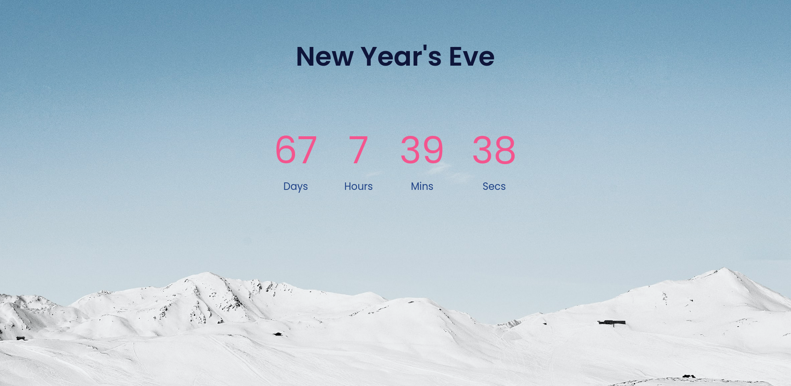

<h2 align="center">  Countdown Timer </h2>

 

### About the Project : 

This mini project shows the time remaining for the upcoming New Year's Eve. Time is shown in Days, Hours, Minutes and Seconds remaining. Simple JavaScript functions are used to make this project. I am adding a screenshot of the project for better understanding.

**This project is built with : **

* HTML5
* CSS
* JavaScript

If you find this helpful, feel free to give a  *star* 
You can also follow me on [![LinkedIn][linkedin-shield]][https://www.linkedin.com/in/soham-pal-87393a182/]

